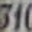
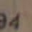
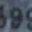
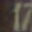
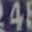
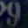

# SVHN Generation: VAE vs Diffusion

[](https://www.python.org/)
[](https://pytorch.org/)
[](https://opensource.org/licenses/MIT)

Генерация уличных номеров (SVHN) с помощью VAE и условной диффузионной модели (DDPM). SVHN представляет собой набор цветных фотографий номеров домов с Google Street View. Датасет является сложным для генерации из-за вариативности фона, освещения и углов съёмки. Обе модели условные, то есть генерируют картинки по заданной цифре (от 0 до 9). Диффузионная модель (DDPM) восстанавливает изображение из случайного шума, постепенно убирая его за 1000 шагов. VAE сжимает картинку в латентное пространство (10 параметров) и учится восстанавливать обратно. Для оценки качества сделан тест, в котором нужно отличить картинки сгенерированные диффузионной моделью от настоящих.

## Тест "Угадай ИИ"

👉 [Отличить ИИ от реальных номеров](https://david-z-ai.github.io/svhn-digits-generation/)

## Реальные (оригиналы SVHN)
  

## VAE (реконструкция)
  

## Диффузия (генерация)
  

## Быстрый старт

```bash
# Клонируй репозиторий
git clone https://github.com/[ТВОЙ_НИК]/[НАЗВАНИЕ_РЕПО].git
cd [НАЗВАНИЕ_РЕПО]

# Установи зависимости
pip install -r requirements.txt

# Скачай веса модели (ссылка в разделе "Скачать весы") в папку weights/
# Или обучи сам:
python train_vae.py
python train_diffusion.py

# Сгенерируй примеры (появятся в samples/)
python generate.py --model diffusion --num 100 --class 5

# Запусти тест локально
cd test_ai && python -m http.server 8000
# Открой в браузере http://localhost:8000
